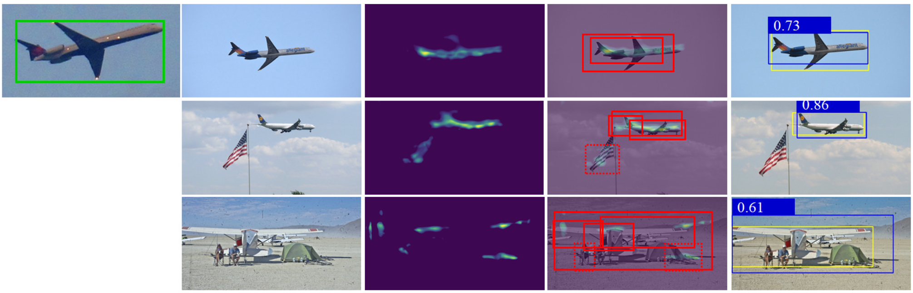
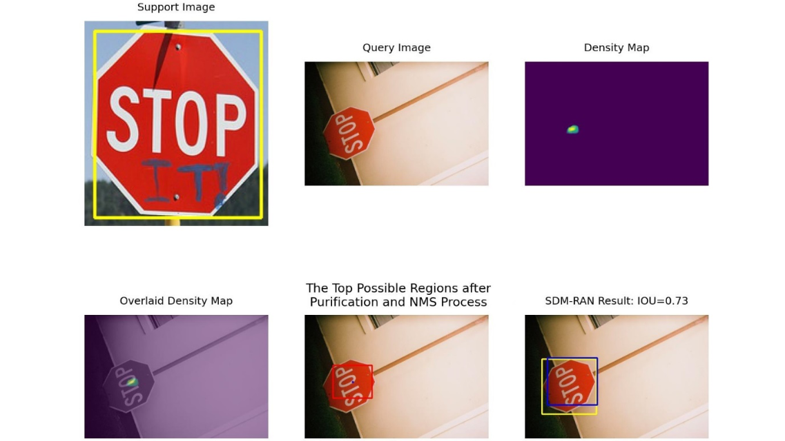

# SDM-RAN-AAAI

This repository contains the demos for paper **Detect an Object At Once without Fine-tuning**.
## Abstract
When presented with one or a few photos of a previously unseen object, humans can instantly recognize it in different scenes. Although the human brain mechanism behind this phenomenon is still not fully understood, this work introduces a novel technical realization of this task. It consists of two phases: (1) generating a **Similarity Density Map (SDM)** by convolving the scene image with the given object image patch(es) so that the highlight areas in the SDM indicate the possible locations; (2) obtaining the object occupied areas in the scene through a **Region Align Network (RAN)**. The RAN is constructed on a backbone of Deep Siamese Network (DSN), and different from the traditional DSNs, it aims to obtain the object accurate regions by regressing the location and area differences between the ground truths and the predicted ones indicated by the highlight areas in SDM. By pre-learning from labels annotated in traditional datasets, the SDM-RAN can detect previously unknown objects without fine-tuning. Experiments were conducted on the COCO dataset. The results indicate that the proposed method outperforms state-of-the-art methods on the same task. 
## Deatiled Introduction
Detailed introduction on the demos can be found [here](https://github.com/Brronnie/SDM-RAN-AAAI/blob/main/Introduction.pdf).
## Installation
+ Install PyTorch:
```shell
conda install pytorch=1.13.1 torchvision torchaudio cudatoolkit=11.8 -c pytorch
```
+ Install necessary packages with `requirements.txt`
```pshell
pip install -r requirements.txt
```
+ Download the model weights file using following URLs
    - Download at [Siamese.pt](https://drive.google.com/file/d/19Ga696qZKdwLGhIBb2EdoK2FkKovtCF8/view?usp=share_link)  
    - Move to the path: `SDM-RAN/FSOD-AO/data/models/Siamese.pt`  
#### The code was developed and tested with Python 3.8, Pytorch 1.13.1, and opencv 4.6.0
## Code Directory Structure
```
├── SDM-RAN
│   ├── FSOD-AO
│   │   ├── detect.py -> python file for detection									
│   │   │   ├── utils -> the definition files of SDM and RAN
│   │   │   ├── data -> the auxiliary models and labels file folder
│   │   │   │   ├── models -> the weight files for SDM and RAN
│   │   │   │   ├── annotations -> the annotations of coco_train and coco_val
│   │   │   ├── detect
│   │   │   │   ├── [category_id]
│   │   │   │   │   ├── support -> the k-shot support images
│   │   │   │   │   ├── query -> the query images
│   │   │   │   │   ├── result -> the visualization results of detection
```
The codes, models and related images (from COCO dataset) for FSOD-AO task are contained in FSOD-AO file folder.
## Quick Demo for FSOD-AO

To run the quick demo for FSOD-AO task, run
```shell
cd FSOD-AO
```
```shell
python detect.py --category <category_id>
```
where <category_id> corresponds to the category annotated in COCO dataset, for example: "13" is the object index for “stop sign”. Due to the large amount of data, we have selected a selection of images from a number of categories for reference. The specific <category_id> can be found in the detect folder.

## License
Code: [Apache License](https://github.com/Brronnie/SDM-RAN-AAAI/blob/main/LICENSE)
